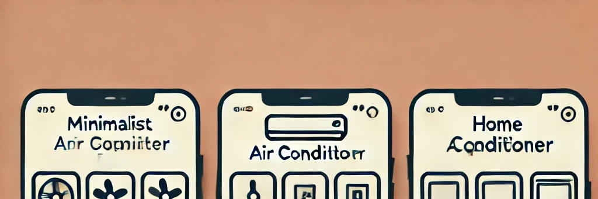
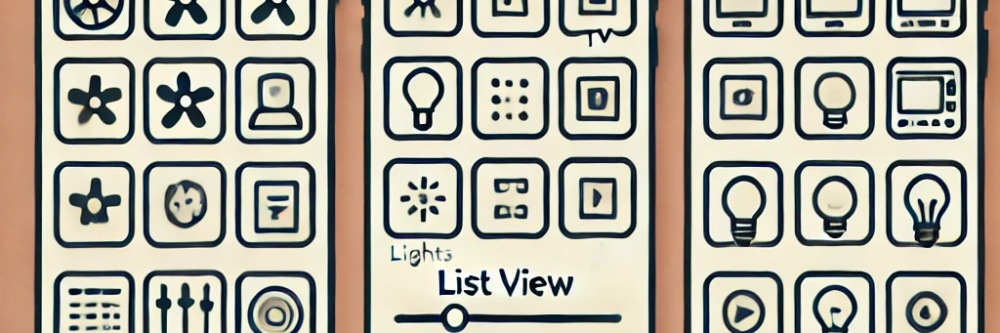
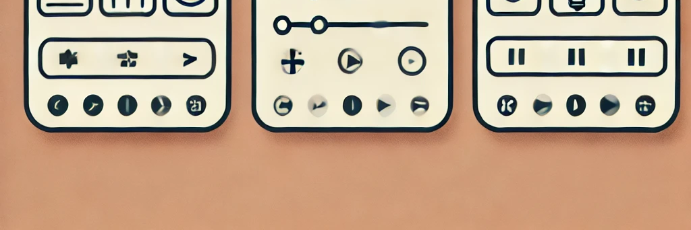

# Smart Home Control UI/UX Design

## Problem Statement
**Platform**: Mobile App  
**Tool**: Figma

### Description:
Build a UI/UX solution for a mobile application that controls home appliances such as:
- Fan
- Air Conditioner
- TV
- Lights & Bulbs (with adjustable brightness and color)

### Requirements:
- A single screen with a list of all appliances.
- Control options for each appliance:
  - ON/OFF toggle
  - Temperature control for Air Conditioner
  - Speed control for Fan
  - Brightness adjustment for Lights & Bulbs
  - Color adjustment for Lights

### Objective:
Design a clean and appealing UI/UX with multiple design options for the screen.

## Design Options

### Option 1: Minimalist Grid Layout

### Option 2: List View Layout

### Option 3: Card-Based Layout

## Figma File
You can view and interact with the designs directly on Figma: [Figma File Link](https://www.figma.com/your-figma-file-link)
